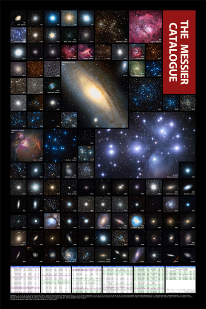

# Messier Object Catalogue Poster
Charles Messier was an 18th-century astronomer who explored comets in the night sky. Messier knew that star clusters, nebulae, and galaxies that looked like comets were interfering with observations, so he wrote them down one by one so that he would not mistake them for comets. The list of these celestial bodies is the Messier objects.

The poster shows 109 Messier objects. Each celestial body is marked within a tiled square. The width of one tile has a viewing angle of 0.5°. They are all the same scale, which will help you compare the relative sizes of celestial bodies. (The celestial bodies across multiple tiles has subtly different viewing angles, but not a big difference from multiple of tile numbers.)

   * Poster size: 560mm wide X 840mm long
   * M102 is included in the Messier list, but no equivalent objects have been found. 

# Version History
  * v1.2-May 8, 2013 ()
    * Retrive celestial data from Wikipedia
    * Reduce line spacing
    * Change the label position of the M110
    * Change the paper size (560mm x 840mm, ratio consists of 2:3) 

# License
The PDF file can be used for personal or academic purposes only. Commercial use is prohibited

The frame of the poster can be used if it complies with the Attribution-NonCommercial-ShareAlike 4.0 International license, but the photo should be used only if the copyright is satisfied. The Digitized Sky Survey (DSS) images do not require express permission provided the copyright holder's terms of use are satisfied, but other photographs may require explicit permission. Please note that the images without i in the WikiSky directory were typeset by DSS.

The source file (messier_catalogue.hml) was written in Hancom Office HWPML 2.X format. It is specified to use Myriad Pro fonts in the source file, but if you do not have a license for this font, you must substitute another font.

# 메시에 천체 목록 포스터
샤를 메시에는 18세기의 천문학자로 밤하늘에서 혜성을 탐색하였습니다. 메시에는 혜성과 비슷하게 보이는 성단이나 성운, 은하가 관측에 방해를 준다는 것을 알고, 이러한 천체를 혜성으로 착각하지 않도록 하나 둘씩 기록해 두었습니다. 이들 천체를 모아 정리해 둔 것이 메시에 목록입니다.

이 포스터는 109개의 메시에 천체를 보여줍니다. 각각의 천체는 타일 형태의 사각형 내에 표시되어 있습니다. 타일 하나의 너비는 0.5°의 시야각을 갖습니다. 모두 축척이 같아 천체의 상대적인 크기를 비교하는 데 도움이 될 것입니다. (여러 타일에 걸친 천체의 축적은 미묘하게 차이 나지만 큰 차이는 아닙니다.)

  * 포스터 크기: 가로 560mm X 세로 840mm
  * M102는 메시에 목록에는 포함되어 있으나 이에 해당하는 천체가 발견되지 않았습니다.

# 버전
  * v1.2 – 2013년 5월 8일
    * 천체 데이터를 Wikipedia에서 참조
    * 줄간격 축소. M110의 레이블 위치 변경
    * 종이크기 변경 (560mm x 840mm, 비율을 2:3으로 구성)
  * v1.0 – 2013년 3월 26일
    * M24와 M40의 사진 및 천체 자료 추가
    * 전체적인 디자인 및 구성 수정
    * 종이크기 변경 (너비 573mm → 555mm)
  * v0.9 – 2012년 4월 28일
    * M45 플레이아데스 성단 및 M34 이미지가 M35의 것으로 잘못 지정된 것 수정
    * M45 플레이아데스 성단의 크기에 맞추어 전체 천체 재배치
    * 종이크기 변경 (너비 525mm → 573mm)
  * v0.8 – 2012년 1월 6일
    * 최초 공개

# License
PDF로 조판된 포스터는 개인적이거나 학술적인 용도로만 사용할 수 있습니다. 상업적인 용도의 사용을 금지합니다

포스터의 틀은 Attribution-NonCommercial-ShareAlike 4.0 International 라이선스를 준수하실 경우 사용할 수 있으나, 사진은 저작권을 만족하셨을 경우에만 사용하여야합니다. The Digitized Sky Survey (DSS) 이미지는 저작권자의 사용조건에 만족하면 명시적으로 허가를 받지 않아도 되나 다른 사진은 명시적인 허가가 필요할 수 있습니다. WikiSky 디렉토리 내의 i가 붙지 않은 이미지가 DSS에서 조판된 것임을 알려드립니다.

소스 파일(messier catalogue.hml)은 한컴오피스 한글 HWPML 2.X 형식으로 작성되었습니다. 소스 파일에서 Myriad Pro 글꼴을 사용하도록 지정되었습니다만, 이 글꼴의 사용권이 없는 경우 다른 글꼴로 대체하여 사용해야합니다.

# Copyrights
COPYRIGHTS 2, 11, 15, 16, 22, 27, 46, 51, 63, 76, 94, 95, 99, 104, and 109 © Jim Misti, http://www.mistisoftware.com/astronomy/., 7, 14, 33, and 98 © NOAO/AURA., 8, 16, 41, 45, 52, 61, 74, 78, 81, 82, 87, 88, 94, 95, 99, and 106 © Robert Gendler, http://www.robgendlerastropics.com/., 12 © Michael Gariepy/Adam Block/NOAO/AURA/NSF., 17 © Michael Sidonio, http://www.pbase.com/strongmanmike2002., 20 © Mischa Schirmer, http://www.astro.uni-bonn.de/~mischa/., other images: The Digitized Sky Survey was produced at the Space Telescope Science Institute under U.S. Government grant NAG W-2166. The images of these surveys are based on photographic data obtained using the Oschin Schmidt Telescope on Palomar Mountain and the UK Schmidt Telescope. The plates were processed into the present compressed digital form with the permission of these institutions.
